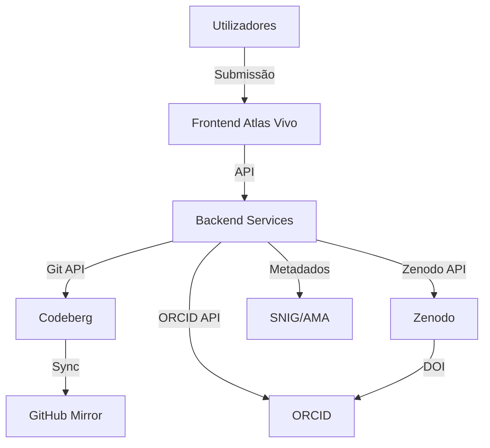

# Atlas Vivo System Architecture Diagram

## Diagram

## Version Info
- **Version**: 1.0.0
- **Date**: 2026-07-18
- **Author**: Vibe Work Agent
- **Source**: Extracted from documentacao-tecnica-ai-act.md