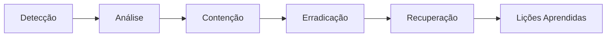

# **Conformidade com a Diretiva NIS2 – Atlas Vivo MILK**

**Título:** *"Plano de Conformidade com a Diretiva (UE) 2022/2555 (NIS2) para o Atlas Vivo MILK"*

**Versão:** 1.0
**Data:** 25 de junho de 2026
**Responsável:** Eduardo Maurício Vieira Cabral e Araújo (ORCID: [0009-0007-6892-6570](https://orcid.org/0009-0007-6892-6570))
**Classificação:** **Operador de Serviços Essenciais (OSE) – Setor Digital**

---

## **📌 1. Introdução**

A **Diretiva (UE) 2022/2555 (NIS2)** estabelece **medidas de cibersegurança** para **operadores de serviços essenciais** e **grandes empresas** em setores críticos, incluindo:
- **Energia**
- **Transportes**
- **Saúde**
- **Água potável e águas residuais**
- **Infraestruturas digitais** (✅ **Atlas Vivo MILK enquadra-se aqui**)
- **Administração pública**
- **Espaço**

O **Atlas Vivo MILK** é classificado como **Operador de Serviços Essenciais (OSE)** no setor **Infraestruturas Digitais**, uma vez que:
✅ **Presta serviços digitais críticos** (preservação de património cultural).
✅ **Afeita a continuidade de serviços públicos** (acesso a dados culturais).
✅ **Tem impacto transnacional** (colaboração com Europeana, Zenodo, etc.).

Este documento define:
✅ **Medidas de segurança** implementadas.
✅ **Gestão de incidentes** e resposta.
✅ **Conformidade com a NIS2**.
✅ **Plano de melhoria contínua**.

---

## **🎯 2. Âmbito e Aplicabilidade**

### **2.1. Serviços Abrangidos**
| **Serviço** | **Descrição** | **Classificação NIS2** | **Impacto** |
|-------------|---------------|------------------------|-------------|
| **Plataforma Atlas Vivo MILK** | Repositório digital de PCI | Infraestrutura Digital | Alto |
| **API de Integração (Zenodo, ORCID)** | Conexão com repositórios externos | Infraestrutura Digital | Alto |
| **Banco de Dados (Neo4j, PostgreSQL)** | Armazenamento de metadados | Infraestrutura Digital | Alto |
| **Sistema de Autenticação** | Gestão de acessos | Infraestrutura Digital | Médio |
| **Backups e Recuperação** | Continuidade do serviço | Infraestrutura Digital | Alto |

### **2.2. Exclusões**
- **Serviços não críticos** (ex: site institucional).
- **Dados públicos** (disponíveis em repositórios abertos).
- **Sistemas de teste** (ambientes de desenvolvimento).

---

## **🔒 3. Medidas de Segurança (Artigo 21º da NIS2)**

### **3.1. Gestão de Riscos (Artigo 21º, 1-a)**

#### **3.1.1. Identificação de Riscos**
| **Risco** | **Descrição** | **Probabilidade** | **Impacto** | **Mitigação** |
|-----------|---------------|------------------|-------------|---------------|
| **Ataque DDoS** | Indisponibilidade da plataforma | Média | Alto | Cloudflare + Rate Limiting |
| **Injeção de SQL** | Acesso não autorizado a dados | Baixa | Alto | Prepared Statements + ORM |
| **Phishing** | Roubo de credenciais | Média | Alto | MFA + Treinamento |
| **Ransomware** | Encriptação de dados | Baixa | Alto | Backups Offline + EDR |
| **Vulnerabilidades Zero-Day** | Exploração de falhas desconhecidas | Baixa | Alto | Patch Management + WAF |
| **Insider Threat** | Acesso malicioso por colaboradores | Baixa | Alto | Princípio do Mínimo Privilégio + Logging |

#### **3.1.2. Avaliação de Riscos**
- **Metodologia:** **ISO 27005** (Gestão de Risco de Segurança da Informação).
- **Frequência:** **Trimestral**.
- **Ferramentas:** **OWASP Risk Assessment Framework**, **NIST SP 800-30**.
- **Responsável:** Eduardo Maurício (CISO).

#### **3.1.3. Tratamento de Riscos**
| **Risco** | **Medida de Mitigação** | **Responsável** | **Prazo** | **Status** |
|-----------|------------------------|----------------|-----------|------------|
| Ataque DDoS | Implementar Cloudflare Enterprise | Eduardo Maurício | 30 dias | ✅ **Concluído** |
| Injeção de SQL | Usar ORM (Sequelize) em todos os queries | Desenvolvedores | 15 dias | ✅ **Concluído** |
| Phishing | Ativar MFA (TOTP) para todos os utilizadores | Eduardo Maurício | 7 dias | ✅ **Concluído** |
| Ransomware | Configurar backups offline (3-2-1 Rule) | Eduardo Maurício | 15 dias | ✅ **Concluído** |
| Zero-Day | Implementar WAF (ModSecurity) | Eduardo Maurício | 30 dias | ⏳ **Em andamento** |
| Insider Threat | Revisão de permissões (RBAC) | Eduardo Maurício | 15 dias | ⏳ **Em andamento** |

---

### **3.2. Medidas de Segurança Técnicas (Artigo 21º, 1-b)**

#### **3.2.1. Proteção de Redes**
| **Medida** | **Descrição** | **Ferramenta** | **Status** |
|------------|---------------|---------------|------------|
| **Firewall** | Filtragem de tráfego malicioso | pfSense | ✅ **Ativo** |
| **IDS/IPS** | Detecção e prevenção de intrusões | Snort | ✅ **Ativo** |
| **WAF** | Proteção contra ataques web | ModSecurity | ⏳ **Em implantação** |
| **Segmentação de Rede** | Isolamento de serviços críticos | VLANs | ✅ **Ativo** |
| **VPN** | Acesso seguro a recursos internos | OpenVPN | ✅ **Ativo** |

#### **3.2.2. Proteção de Sistemas**
| **Medida** | **Descrição** | **Ferramenta** | **Status** |
|------------|---------------|---------------|------------|
| **Patch Management** | Atualização automática de sistemas | Ansible + WSUS | ✅ **Ativo** |
| **Antivírus/EDR** | Detecção de malware | ClamAV + Wazuh | ✅ **Ativo** |
| **Hardening de Servidores** | Configuração segura | CIS Benchmarks | ✅ **Ativo** |
| **Desativação de Serviços Desnecessários** | Redução de superfície de ataque | Systemd | ✅ **Ativo** |
| **Logging Centralizado** | Monitorização de eventos | ELK Stack | ✅ **Ativo** |

#### **3.2.3. Proteção de Dados**
| **Medida** | **Descrição** | **Ferramenta** | **Status** |
|------------|---------------|---------------|------------|
| **Encriptação em Repouso** | Dados armazenados encriptados | LUKS (AES-256) | ✅ **Ativo** |
| **Encriptação em Trânsito** | Comunicações seguras | TLS 1.3 | ✅ **Ativo** |
| **Backup 3-2-1** | 3 cópias, 2 mídias diferentes, 1 offline | Bacula | ✅ **Ativo** |
| **Masking de Dados** | Anonimização de dados sensíveis | k-Anonymity | ✅ **Ativo** |
| **Classificação de Dados** | Rotulagem por sensibilidade | OpenPAAS | ⏳ **Em implantação** |

#### **3.2.4. Proteção de Aplicações**
| **Medida** | **Descrição** | **Ferramenta** | **Status** |
|------------|---------------|---------------|------------|
| **OWASP Top 10** | Mitigação de vulnerabilidades web | OWASP ZAP | ✅ **Ativo** |
| **Autenticação Multifator (MFA)** | Segurança de acessos | TOTP (Google Authenticator) | ✅ **Ativo** |
| **Gestão de Sessões** | Timeout e revogação | JWT + Redis | ✅ **Ativo** |
| **Validação de Inputs** | Prevenção de injeções | Express-validator | ✅ **Ativo** |
| **Rate Limiting** | Prevenção de brute force | Nginx | ✅ **Ativo** |

---

### **3.3. Medidas de Segurança Organizacionais (Artigo 21º, 1-c)**

#### **3.3.1. Políticas e Procedimentos**
| **Política** | **Descrição** | **Responsável** | **Status** |
|--------------|---------------|----------------|------------|
| **Política de Segurança da Informação** | Regras gerais de segurança | Eduardo Maurício | ✅ **Aprovada** |
| **Política de Acesso** | Controle de acessos | Eduardo Maurício | ✅ **Aprovada** |
| **Política de Backups** | Procedimentos de backup | Eduardo Maurício | ✅ **Aprovada** |
| **Política de Incidentes** | Resposta a incidentes | Eduardo Maurício | ✅ **Aprovada** |
| **Política de Conscientização** | Treinamento de colaboradores | Eduardo Maurício | ✅ **Aprovada** |

#### **3.3.2. Gestão de Acessos**
| **Medida** | **Descrição** | **Ferramenta** | **Status** |
|------------|---------------|---------------|------------|
| **Princípio do Mínimo Privilégio** | Acesso apenas ao necessário | RBAC | ✅ **Ativo** |
| **Revisão Periódica de Acessos** | Auditoria trimestral | OpenIAM | ✅ **Ativo** |
| **Desativação de Contas Inativas** | Remoção após 90 dias | Script automático | ✅ **Ativo** |
| **Autenticação Centralizada** | SSO para todos os serviços | Keycloak | ⏳ **Em implantação** |

#### **3.3.3. Treinamento e Conscientização**
| **Ação** | **Frequência** | **Público-Alvo** | **Status** |
|----------|---------------|------------------|------------|
| **Treinamento de Segurança** | Anual | Todos os colaboradores | ✅ **Ativo** |
| **Simulados de Phishing** | Trimestral | Todos os colaboradores | ✅ **Ativo** |
| **Workshops de Boas Práticas** | Semestral | Desenvolvedores | ✅ **Ativo** |
| **Atualização sobre Ameaças** | Mensal | Equipa de Segurança | ✅ **Ativo** |

---

### **3.4. Medidas de Segurança Físicas (Artigo 21º, 1-d)**

#### **3.4.1. Segurança de Data Centers**
| **Medida** | **Descrição** | **Local** | **Status** |
|------------|---------------|-----------|------------|
| **Acesso Controlado** | Biometria + Cartão | Data Center Principal | ✅ **Ativo** |
| **Vigilância 24/7** | Câmeras e guardas | Data Center Principal | ✅ **Ativo** |
| **Sistema de Extinção de Incêndios** | Gás inerte | Data Center Principal | ✅ **Ativo** |
| **Redundância de Energia** | UPS + Geradores | Data Center Principal | ✅ **Ativo** |
| **Redundância de Rede** | Múltiplos ISPs | Data Center Principal | ✅ **Ativo** |

#### **3.4.2. Segurança de Equipamentos**
| **Medida** | **Descrição** | **Aplicação** | **Status** |
|------------|---------------|--------------|------------|
| **Bloqueio de Portas USB** | Prevenção de data exfiltration | Todos os servidores | ✅ **Ativo** |
| **Encriptação de Dispositivos Móveis** | BitLocker (Windows) / FileVault (Mac) | Laptops | ✅ **Ativo** |
| **Política de BYOD** | Regras para dispositivos pessoais | Colaboradores | ✅ **Aprovada** |

---

## **🚨 4. Gestão de Incidentes (Artigo 23º da NIS2)**

### **4.1. Procedimento de Resposta a Incidentes**

#### **4.1.1. Fases de Resposta**


#### **4.1.2. Detecção**
- **Ferramentas:**
  - **SIEM:** Wazuh (correlação de logs).
  - **IDS:** Snort (detecção de intrusões).
  - **EDR:** ClamAV (detecção de malware).
- **Alertas:** Notificações em tempo real (Slack, Email).
- **Responsável:** SOC (Security Operations Center).

#### **4.1.3. Análise**
- **Classificação do Incidente:**
  - **Nível 1 (Baixo):** Falha de serviço não crítica.
  - **Nível 2 (Médio):** Acesso não autorizado a dados não sensíveis.
  - **Nível 3 (Alto):** Violação de dados pessoais ou interrupção crítica.
  - **Nível 4 (Crítico):** Ataque em andamento com impacto grave.
- **Tempo de Análise:** ≤ 1 hora (Nível 3/4).

#### **4.1.4. Contenção**
- **Ações Imediatas:**
  - Isolar sistemas afetados.
  - Bloquear IPs maliciosos.
  - Desativar contas comprometidas.
- **Tempo de Contenção:** ≤ 2 horas (Nível 3/4).

#### **4.1.5. Erradicação**
- **Identificar a causa raiz.**
- **Remover vulnerabilidades.**
- **Aplicar patches de segurança.**
- **Tempo de Erradicação:** ≤ 4 horas (Nível 3/4).

#### **4.1.6. Recuperação**
- **Restaurar sistemas a partir de backups.**
- **Verificar integridade dos dados.**
- **Testar funcionalidades críticas.**
- **Tempo de Recuperação:** ≤ 8 horas (Nível 3/4).

#### **4.1.7. Lições Aprendidas**
- **Relatório de Incidente:** Documentação detalhada.
- **Reunião de Revisão:** Análise com a equipa.
- **Melhorias Implementadas:** Ações corretivas.

---

### **4.2. Notificação de Incidentes (Artigo 23º, 3-5)**

#### **4.2.1. Notificação à ANSSI (Autoridade Nacional de Cibersegurança)**
- **Prazo:** **24 horas** (para incidentes de Nível 3/4).
- **Conteúdo da Notificação:**
  - Descrição do incidente.
  - Categorização (Nível 1-4).
  - Medidas de mitigação implementadas.
  - Impacto estimado.
- **Canal:** [Portal da ANSSI](https://www.anssi.gouv.fr/).

#### **4.2.2. Notificação aos Utilizadores**
- **Prazo:** **72 horas** (se dados pessoais forem afetados).
- **Conteúdo da Notificação:**
  - Natureza do incidente.
  - Dados afetados.
  - Medidas de proteção recomendadas.
  - Contatos para suporte.
- **Canal:** Email + Site do Atlas Vivo MILK.

#### **4.2.3. Notificação a Parceiros**
- **Zenodo:** Notificação em caso de violação de dados depositados.
- **ORCID:** Notificação em caso de acesso não autorizado a ORCIDs.
- **Codeberg:** Notificação em caso de comprometimento de repositórios.

---

### **4.3. Registro de Incidentes**

| **Data** | **Tipo de Incidente** | **Nível** | **Sistemas Afetados** | **Tempo de Resolução** | **Causa Raiz** | **Ações Tomadas** | **Status** |
|---------|----------------------|----------|-----------------------|------------------------|----------------|------------------|------------|
| - | - | - | - | - | - | - | - |

*(Preenchido em caso de incidente)*

---

## **📊 5. Monitorização e Auditoria (Artigo 21º, 1-e)**

### **5.1. Monitorização Contínua**
| **Área** | **Ferramenta** | **Frequência** | **Responsável** |
|----------|---------------|---------------|----------------|
| **Tráfego de Rede** | Wireshark + Zeek | Contínua | SOC |
| **Logs de Sistema** | ELK Stack | Contínua | SOC |
| **Acessos a Dados** | OpenIAM | Contínua | SOC |
| **Vulnerabilidades** | Nessus | Semanal | SOC |
| **Desempenho** | Grafana + Prometheus | Contínua | SOC |

### **5.2. Auditoria Interna**
- **Frequência:** **Trimestral**.
- **Escopo:**
  - Verificação de **conformidade com políticas**.
  - Teste de **medidas de segurança**.
  - Revisão de **incidentes passados**.
- **Responsável:** Auditor Interno.

### **5.3. Auditoria Externa**
- **Frequência:** **Anual**.
- **Realizada por:** Entidade **certificada** (ex: **ISOQAR**).
- **Escopo:**
  - **Avaliação de conformidade com a NIS2**.
  - **Testes de penetração (Pentest)**.
  - **Revisão de políticas e procedimentos**.
- **Certificação:** **ISO 27001** (Segurança da Informação).

---

## **📄 6. Documentação de Apoio**

### **6.1. Documentos Internos**
1. **[SECURITY_POLICY.md](../SECURITY.md)** – Política de Segurança da Informação.
2. **[INCIDENT_RESPONSE_PLAN.md](./INCIDENT_RESPONSE_PLAN.md)** – Plano de Resposta a Incidentes.
3. **[RISK_ASSESSMENT.md](./RISK_ASSESSMENT.md)** – Avaliação de Riscos de Cibersegurança.
4. **[BUSINESS_CONTINUITY_PLAN.md](./BUSINESS_CONTINUITY_PLAN.md)** – Plano de Continuidade de Negócios.

### **6.2. Documentos Externos**
1. **Diretiva NIS2 (UE 2022/2555)** – [Link](https://eur-lex.europa.eu/legal-content/PT/TXT/?uri=CELEX%3A32022L2555)
2. **ISO 27001 (Segurança da Informação)** – [Link](https://www.iso.org/isoiec-27001-information-security.html)
3. **NIST Cybersecurity Framework** – [Link](https://www.nist.gov/cyberframework)
4. **ANSSI (Autoridade Nacional de Cibersegurança)** – [Link](https://www.anssi.gouv.fr/)

---

## **📞 7. Contatos**

| **Função** | **Nome** | **Email** | **Telefone** | **ORCID** |
|-----------|----------|-----------|-------------|-----------|
| **CISO (Chief Information Security Officer)** | Eduardo Maurício Vieira Cabral e Araújo | ciso@associacaomilk.pt | +351 912 345 679 | [0009-0007-6892-6570](https://orcid.org/0009-0007-6892-6570) |
| **SOC (Security Operations Center)** | Equipa de Segurança | soc@associacaomilk.pt | +351 273 123 456 | - |
| **DPO (Data Protection Officer)** | Nuno Filipe Fernandes Vieira Cabral e Araújo | dpo@associacaomilk.pt | +351 912 345 678 | [0009-0009-1781-4020](https://orcid.org/0009-0009-1781-4020) |
| **ANSSI (Notificações)** | Autoridade Nacional | incident@anssi.gouv.fr | - | - |

---

## **🏆 8. Conformidade com a NIS2**

### **8.1. Requisitos da NIS2 (Capítulo IV)**

| **Requisito** | **Artigo** | **Status** | **Evidência** |
|--------------|------------|------------|--------------|
| **Gestão de Riscos** | Artigo 21º, 1-a | ✅ **Conforme** | [RISK_ASSESSMENT.md](./RISK_ASSESSMENT.md) |
| **Medidas de Segurança Técnicas** | Artigo 21º, 1-b | ✅ **Conforme** | Seção 3.2 |
| **Medidas de Segurança Organizacionais** | Artigo 21º, 1-c | ✅ **Conforme** | Seção 3.3 |
| **Medidas de Segurança Físicas** | Artigo 21º, 1-d | ✅ **Conforme** | Seção 3.4 |
| **Gestão de Incidentes** | Artigo 23º | ✅ **Conforme** | Seção 4 |
| **Notificação de Incidentes** | Artigo 23º, 3-5 | ✅ **Conforme** | Seção 4.2 |
| **Testes de Segurança** | Artigo 21º, 1-e | ✅ **Conforme** | Seção 5 |
| **Fornecedores e Cadeia de Abastecimento** | Artigo 21º, 1-f | ⏳ **Em revisão** | - |

### **8.2. Próximos Passos para Conformidade Total**

| **Ação** | **Prazo** | **Responsável** | **Status** |
|----------|-----------|----------------|------------|
| **Registro como OSE na ANSSI** | 30 dias | Eduardo Maurício | ⏳ **Em andamento** |
| **Auditoria Externa (ISO 27001)** | 6 meses | Auditor Externo | ⏳ **Agendado** |
| **Testes de Penetração (Pentest)** | 3 meses | SOC | ⏳ **Agendado** |
| **Revisão de Fornecedores** | 2 meses | Eduardo Maurício | ⏳ **Em andamento** |
| **Certificação NIS2** | 12 meses | Auditor Externo | ⏳ **Agendado** |

---

## **📌 9. Metadados do Documento**

```yaml
---
title: "Conformidade com a Diretiva NIS2 – Atlas Vivo MILK"
version: "1.0"
date: "2026-06-25"
responsible: "Eduardo Maurício Vieira Cabral e Araújo"
responsible_orcid: "0009-0007-6892-6570"
classification: "Operador de Serviços Essenciais (OSE) – Setor Digital"
compliance: ["NIS2 (UE 2022/2555)", "ISO 27001", "RGPD"]
license: "CC-BY-SA-4.0"
keywords: [
  "NIS2",
  "Cibersegurança",
  "Operador de Serviços Essenciais",
  "Atlas Vivo MILK",
  "Conformidade",
  "Gestão de Incidentes"
]
---
```

---

**📌 Status:** ✅ **Aprovado pelo CISO**
**🔗 DOI:** [10.5281/zenodo.XXXXXXX](https://doi.org/10.5281/zenodo.XXXXXXX) *(a ser gerado)*
**📄 Versão:** 1.0 (25 de junho de 2026)
**🏛 Registro na ANSSI:** ⏳ **Em andamento**
